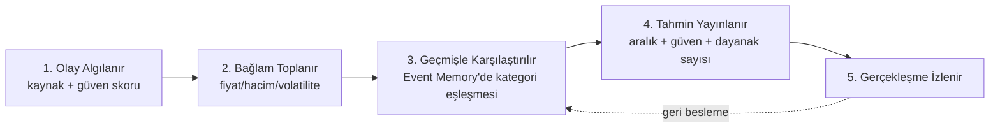
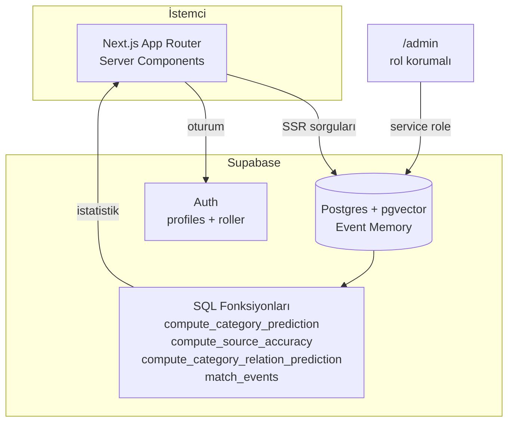

<div align="center">


# Ziya

**Piyasa haberine ışık tutan yapay zekâ ajanı**

[](https://github.com/theitmanmike/Ziya/actions/workflows/ci.yml)
[](LICENSE)
[](https://nextjs.org)

[**Canlı Demo**](https://ziya.cicibyte.com) · [Proje Dosyası](../Proje%20Dosyası.md) · [Yol Haritası](TODO.md)

</div>

---

Ziya, piyasaya düşen her haberi geçmişteki binlerce benzer olayla karşılaştırıp
olası fiyat etkisini güven skoruyla birlikte sunan bir **karar destek**
uygulamasıdır. Söylentiyi doğrulanmış bilgiden ayırır, bir olayın rakip/tedarikçi/
sektör paydaşı üzerindeki zincirleme etkisini hesaplar ve tahminlerini —
yeterli veri yoksa dürüstçe "yeterli veri yok" diyerek — kategori bazlı
istatistiklerden üretir.

> Sunulan tüm tahminler geçmiş olayların istatistiksel analizine dayanır ve
> **yatırım tavsiyesi değildir**.

## İçindekiler

- [Özellikler](#özellikler)
- [Nasıl Çalışır](#nasıl-çalışır)
- [Mimari](#mimari)
- [Teknoloji Yığını](#teknoloji-yığını)
- [Kurulum](#kurulum)
- [Komutlar](#komutlar)
- [Proje Yapısı](#proje-yapısı)
- [Test ve CI/CD](#test-ve-cicd)
- [Güvenlik Modeli](#güvenlik-modeli)
- [Yol Haritası](#yol-haritası)
- [Yasal](#yasal)
- [Lisans](#lisans)

## Özellikler

| Modül                         | Açıklama                                                                                                                                                                                                                                    |
| ----------------------------- | ------------------------------------------------------------------------------------------------------------------------------------------------------------------------------------------------------------------------------------------- |
| **Event Memory**              | Her haber, o anki fiyat/hacim/volatilite bağlamıyla birlikte kalıcı olarak `pgvector` destekli bir veritabanına kaydedilir.                                                                                                                 |
| **Rumor Engine**              | Doğrulanmamış iddiaları (`rumor` → `unverified` → `confirmed`/`false`) yaşam döngüsü boyunca izler; kaynağın **gerçek, hesaplanmış** doğruluk geçmişini çıkarır ve düşük güvenilirlikli kaynakları "Yüksek Yanlış Olasılığı" ile işaretler. |
| **Zincirleme Etki**           | Bir olayın yalnızca birincil şirketi değil; rakiplerini, tedarikçilerini ve sektör paydaşlarını da nasıl etkilediğini kategori bazlı istatistiklerle gösterir.                                                                              |
| **Canlı Hesaplanan Tahmin**   | Geçmişteki benzer olayların ortalama piyasa tepkisinden güven skoru ve aralığıyla birlikte gerçek zamanlı tahmin üretir.                                                                                                                    |
| **Üyelik / Admin / Paketler** | Supabase Auth ile üyelik, rol bazlı admin paneli, Free/Pro/Kurumsal paket modeli.                                                                                                                                                           |

Tahmin/istatistik motorları **gerçekten hesaplayan koddur** — seed verisiyle
doldurulmuş sabit değerler değil. Örnek sayısı istatistiksel olarak yetersizse
(`< 2` veya `< 3`, fonksiyona göre değişir) sistem uydurma bir aralık göstermek
yerine açıkça "yeterli veri yok" der. Bkz. [`supabase/migrations/0003`–`0005`](supabase/migrations/) ve
[`src/lib/statUtils.ts`](src/lib/statUtils.ts).

## Nasıl Çalışır



## Mimari



Beş katmanlı mimari (Proje Dosyası Bölüm 8) şu an şöyle eşleniyor:

1. **Veri Toplama** — şu an demo seed verisi; Faz 5'te Finnhub/NewsAPI/GNews/Guardian/Marketaux/Currents entegrasyonlarıyla canlanacak (anahtarlar yapılandırıldı, entegrasyon kodu henüz yazılmadı — bkz. [TODO.md](TODO.md))
2. **Olay Normalizasyonu** — `supabase/migrations/0001_init_schema.sql`'deki yapısal şema
3. **Event Memory** — Postgres + `pgvector` (`events.embedding`, henüz boş — OpenAI billing bekleniyor)
4. **Analiz Motorları** — `compute_category_prediction`, `compute_source_accuracy`, `compute_category_relation_prediction` (SQL fonksiyonları)
5. **Tahmin ve Karar Motoru** — `src/lib/predictions.ts`, `src/lib/sources.ts`, `src/lib/chainEffect.ts`

## Teknoloji Yığını

- **[Next.js 16](https://nextjs.org)** — App Router, TypeScript, Turbopack, Server Actions
- **[Tailwind CSS v4](https://tailwindcss.com)** — elle yazılmış, bağımlılıksız bileşenler
- **[Supabase](https://supabase.com)** — Postgres + `pgvector` + Auth (Event Memory, üyelik, RLS)
- **[Vitest](https://vitest.dev)** — birim testleri
- **[Vercel](https://vercel.com)** — hosting, otomatik CI/CD deploy

## Kurulum

1. Bağımlılıkları yükleyin:

   ```bash
   npm install
   ```

2. `.env.example` dosyasını `.env.local` olarak kopyalayın ve Supabase
   Dashboard → **Settings → API** sayfasındaki bilgileri girin:

   ```bash
   cp .env.example .env.local
   ```

3. Supabase projesinde şemayı oluşturun — **SQL Editor**'de `supabase/migrations/`
   altındaki dosyaları `0001`'den `0006`'ya sırayla çalıştırın, ardından
   `supabase/seed.sql` ile demo verilerini (5 gerçek hayat senaryosu) yükleyin.

   Supabase CLI kurulduysa alternatif olarak:

   ```bash
   supabase link --project-ref <proje-ref>
   supabase db push
   ```

4. Geliştirme sunucusunu başlatın:

   ```bash
   npm run dev
   ```

   [http://localhost:3000](http://localhost:3000) adresini açın — giriş yapılmamışsa
   showcase sayfası, giriş yapılmışsa `/dashboard` (olay akışı) görünür.

5. (Opsiyonel) İlk admin kullanıcınızı atayın — SQL Editor'de:

   ```sql
   update profiles set role = 'admin' where email = 'sizin-eposta-adresiniz';
   ```

## Komutlar

| Komut                         | Açıklama                                                        |
| ----------------------------- | --------------------------------------------------------------- |
| `npm run dev`                 | Geliştirme sunucusu (Turbopack)                                 |
| `npm run build`               | Prodüksiyon derlemesi                                           |
| `npm run start`               | Prodüksiyon sunucusu                                            |
| `npm run lint`                | ESLint kontrolü                                                 |
| `npm run format`              | Prettier ile kodu formatla                                      |
| `npm run format:check`        | Formatı değiştirmeden kontrol et                                |
| `npm test`                    | Vitest ile birim testleri çalıştır                              |
| `npm run test:watch`          | Testleri izleme modunda çalıştır                                |
| `npm run embeddings:backfill` | Eksik embedding'leri OpenAI ile üret (`OPENAI_API_KEY` gerekir) |

## Proje Yapısı

```
src/
  app/
    page.tsx              # Showcase / karşılama sayfası ("/")
    dashboard/             # Olay akışı (event feed)
    events/[code]/         # Olay detay sayfası
    admin/                 # Rol korumalı admin paneli
    login/, signup/        # Kimlik doğrulama sayfaları
    pricing/, terms/, privacy/
    icon.svg               # Favicon (marka mark'ı, isimsiz)
  components/               # Rozetler, tablolar, kartlar, Logo, AuthForm/AuthNav
  lib/
    supabase/               # Browser/server/admin Supabase client'ları + DB tipleri
    events.ts               # Olay verisi erişim katmanı
    predictions.ts          # Kategori bazlı canlı tahmin
    sources.ts               # Kaynak doğruluk hesaplama + gürültü filtresi
    chainEffect.ts           # Zincirleme etki hesaplama
    statUtils.ts              # Paylaşılan istatistik/güven formülü (test edilebilir, saf fonksiyonlar)
    auth.ts                   # Sunucu tarafı oturum/profil erişimi
  proxy.ts                    # Oturum yenileme (Next.js 16'da middleware.ts → proxy.ts)
supabase/
  migrations/                 # 0001–0006: şema, arama, tahmin motoru, üyelik/roller
  seed.sql                     # Demo veri (5 gerçek hayat senaryosu)
scripts/
  backfill-embeddings.ts       # OpenAI embedding üretim scripti
```

## Test ve CI/CD

- **Birim testleri** ([`src/lib/statUtils.test.ts`](src/lib/statUtils.test.ts)) tahmin
  motorunun ve gürültü filtresinin matematiğini doğrular — eşik değerleri, güven
  skoru formülü, aralık hesaplama.
- **GitHub Actions** (`.github/workflows/ci.yml`) her push/PR'da format kontrolü,
  lint, test ve build çalıştırır. Hiçbir secret gerektirmez — tüm sayfalar
  `force-dynamic` olduğundan Supabase bağlantısı build zamanında değil, istek
  zamanında kurulur.
- **Vercel**, GitHub entegrasyonu üzerinden `main`'e her push'ta otomatik deploy eder.

## Güvenlik Modeli

- Tüm tablolarda Row Level Security (RLS) aktif; herkes **okuyabilir**, hiçbir
  tabloya doğrudan yazma politikası tanımlı değil.
- Yazma işlemleri yalnızca sunucu tarafında, `SUPABASE_SERVICE_ROLE_KEY` ile
  (RLS'yi bypass eder) — asla istemci koduna sızdırılmaz.
- Admin yetkisi kontrolü özyinelemeli RLS sorunlarını önlemek için
  `security definer` bir `is_admin()` fonksiyonuyla yapılır.
- `profiles.role` ve `profiles.subscription_tier` için doğrudan bir `update`
  politikası yoktur — kullanıcılar kendi rollerini/paketlerini değiştiremez.

## Yol Haritası

Fazlı, dürüst bir şekilde işaretlenmiş yol haritası için [TODO.md](TODO.md)
dosyasına bakın — neyin gerçekten test edilip doğrulandığı, neyin hâlâ statik/
placeholder olduğu ve hangi maddelerin dış API anahtarı beklediği açıkça belirtilir.

## Yasal

Bu proje bir yatırım danışmanlığı hizmeti değildir. Detaylar için
[Kullanım Şartları](https://ziya.cicibyte.com/terms) ve
[Gizlilik Politikası](https://ziya.cicibyte.com/privacy) sayfalarına bakın.

## Lisans

[MIT](LICENSE) © 2026 Mikail Özkarcı
